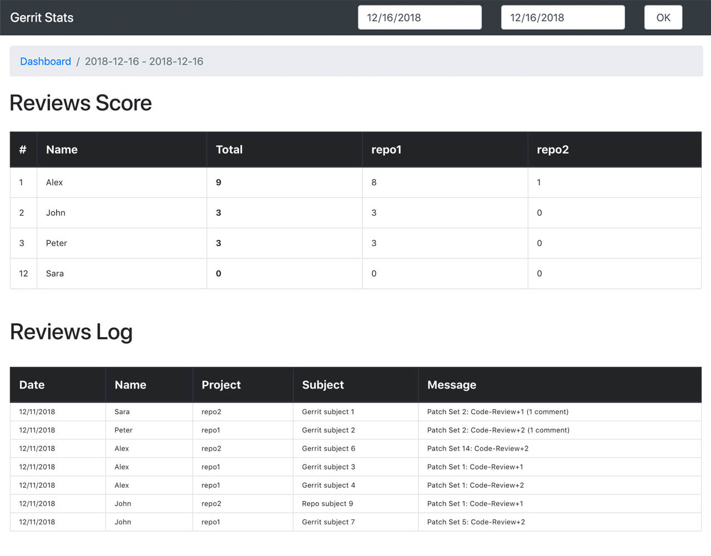

# Gerrit Review Stats v.1.0.4

### Features
- Get reviews count with log of review messages
- Filter by group of team members and multiple projects
- Filter by date in UI

### Web interface

### Set-up and run
- Setup your config.json from example (you should copy cookie from your browser)
- Run npm install
- Run `npm run import` to import in local SQLite (it will create db.sql file)
- Run `npm start` to run review statistics on localhost:3333
